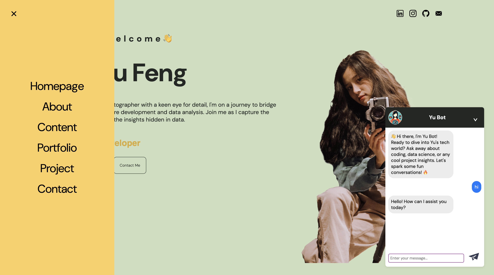

# Personal-Portfolio 🌟

### Portfolio website for my personal use. You can visit it [here](https://yu-feng.me/)🦄. You are free to ask YuBot🤖 any question you want!

## Introduction

This project is a comprehensive showcase of my professional portfolio, developed using React and SCSS for the frontend, with a backend powered by the OpenAI API. It's deployed on Hostinger for the frontend and AWS EC2 for the backend, with Docker containers for easy deployment and NGINX for managing cross-origin resource sharing (CORS).

### You can click any part you are interested in from sidebar🔍. 

## Frontend
💻 Technologies Used

💡React: A JavaScript library for building user interfaces.

💡SCSS: A preprocessor scripting language that is interpreted or compiled into Cascading Style Sheets (CSS).
Deployment

💡Hostinger: The frontend is deployed on Hostinger, a popular web hosting service. This provides a reliable and scalable solution for hosting our React-based portfolio.

## Backend
🤖 OpenAI API Integration with Express.js

The backend is developed using Express.js. For this project, Express.js serves as the backbone for integrating the OpenAI API, facilitating the delivery of dynamic, AI-powered content. This setup not only simplifies the development process but also ensures efficient handling of requests to and from the OpenAI API.

☁️ Deployment with Docker on AWS EC2

💡Docker: The backend is containerized using Docker, ensuring consistency across different development and production environments.

💡AWS EC2: The Docker containers are deployed on an AWS EC2 instance, offering scalable computing capacity.

### My photography collections are available here📷.

